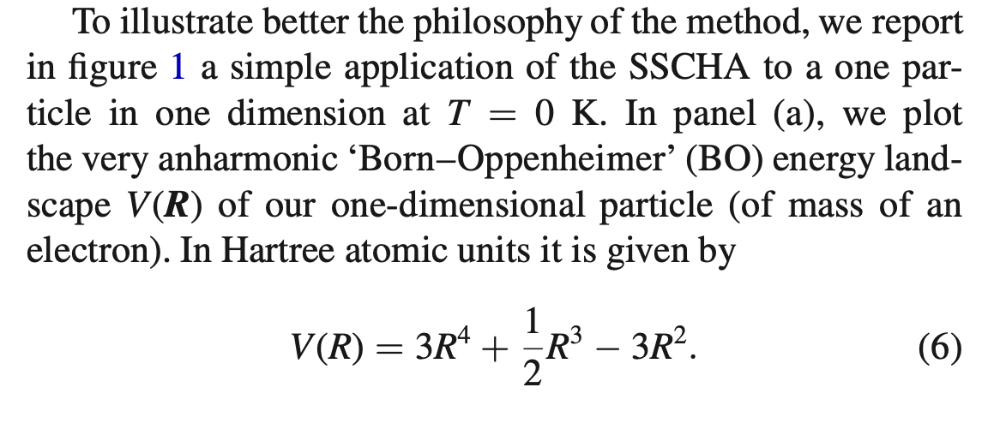
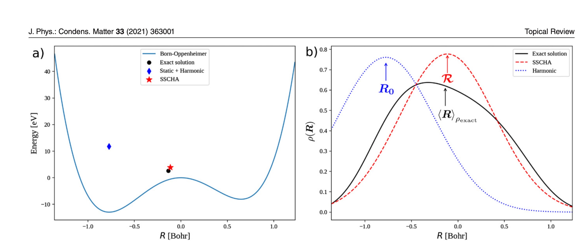

# 1D Quantum
Originated from July, 2024, served as a internship object.

## Problem

Try to solve a one-dimensional quantum mechanic problem with
Hamiltonian

$$
  \hat H = -\frac{1}{2} \nabla^2 + \hat V
$$

with the following potential

$$
V(x) = 3x^4 + \frac{1}{2} x^3 - 3x^2
$$

Some hints on units:

The ground state wavefunction and ground state energy is our target.

- Left: 
  - `Born-Oppenheimer`: the potential plotted with x as x axis.
  - `Exact solution`: the exact ground state energy.
- Right:
  - The probability density (square of wavefunction) w.r.t. x.

## Implementation

### Finite Differential

Using finite differential method to directly constructing
Hamiltonian and Exact Diagonalizing it.

Get the ground state wavefunction and ground state energy.

Then compare it with the reference above.

> NOTE: Please try to rewrite the numpy code using [jax](https://jax.readthedocs.io/en/latest/index.html)!

### VMC (Flow)

A good VMC reference: `reference/ML_for_Materials_Hard_and_Soft_ML_for_Ab_initio_Electronic_Structure_Tutorial_(Solution).ipynb`

Which is cloned from [this repo](https://github.com/CompPhysVienna/MLSummerSchoolVienna2022/blob/main/Day04_July14/ML_for_Materials_Hard_and_Soft_ML_for_Ab_initio_Electronic_Structure_Tutorial_(Solution).ipynb).

Try to use VMC with a Gaussian-based-normalizing-flowed wavefunction ansatz,
calculate the variational ground state.

